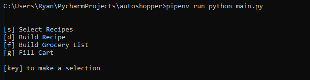
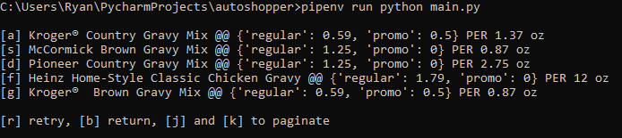
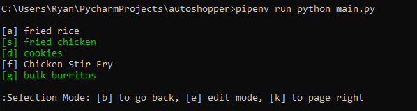
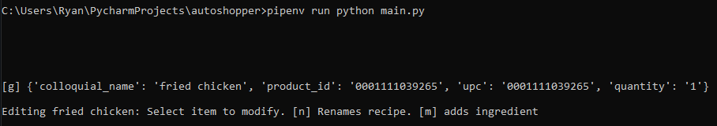

# Auto Shopper

This is a meal planning and grocery shopping program. My objective is to streamline the shopping process and make home cooking 
more accessible by reducing the time costs associated with each.  Kroger's new public API is a great asset to the cause.

### Tech

This project uses [Mozzila's geckodriver](https://github.com/mozilla/geckodriver) to emulate human behavior and 
bootstrap access to OAuth2 tokens.  This requires geckodriver.exe to be in PATH.

It is necessary to [register an app with Kroger](https://developer.kroger.com/), free of charge, to attain a 
client id and client secret.

Current version only compatible with Windows CMD prompt. Strangely not compatible with PowerShell.

### Run 
These four environment variables must be set. The first two require a kroger API account and the second two require
a standard Kroger account (for online shopping).

    "kroger_app_client_id": Set equal to the client id of your app
    "kroger_app_client_secret": Set equal to the client secret of your app
    "kroger_username": Username of a valid kroger account
    "kroger_password": Password of a valid kroger account

First run will require user input to provide consent from the standard kroger account to your new app. Once done:
 
    1) build new recipes  
    2) select which ones you'd like to cook   
    3) construct the grocery list  
    4) Fill cart  
    5) Finalize order through a web browser at kroger.com  

  
<b>Main Menu</b> - Navigate with key strokes as denoted on screen.

 
 

<b>Building a recipe</b> - These are saved to disk for future use.

  
<b> Selecting a recipe</b> - Marks ingredients for purchase

  
<b> Editing a recipe</b> - Modal interface from the select menu allows recipe updates

 

### Planned Improvements
- Pre-fetching product info with additional threads.
- Provide substitution options to allow for price optimization
- Shadow Win32 API calls with curses equivalents for Linux compatibility.
- Allowing store selection instead of hard coding mine ;)